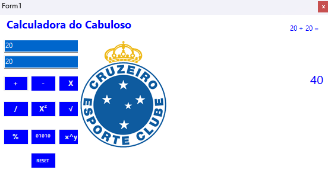
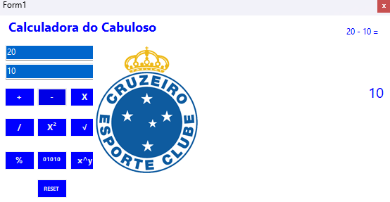
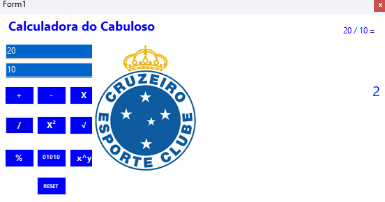
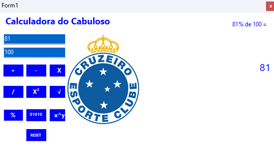
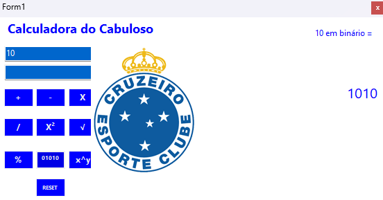
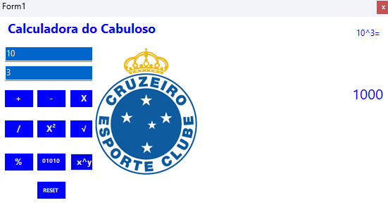

Calculadora do Cabuloso
Este é um simples projeto, feito em Windows Forms com C#, de uma calculadora de operações básicas da matemática.

?? Demosntração do programa:

?? Funções extras:

Subtração de X e Y:

Multiplicação de X e Y:

Divisão de X e Y:

X ao quadrado:

Raiz de X:

Porcentagem de X em relação a Y:

Conversão de decimal para binário:

X elevado a potência de Y:

Baixe a versão do programa aqui
https://github.com/leokgoncalvescruz/lkgc-winforms-calculator/releases/tag/v1.0